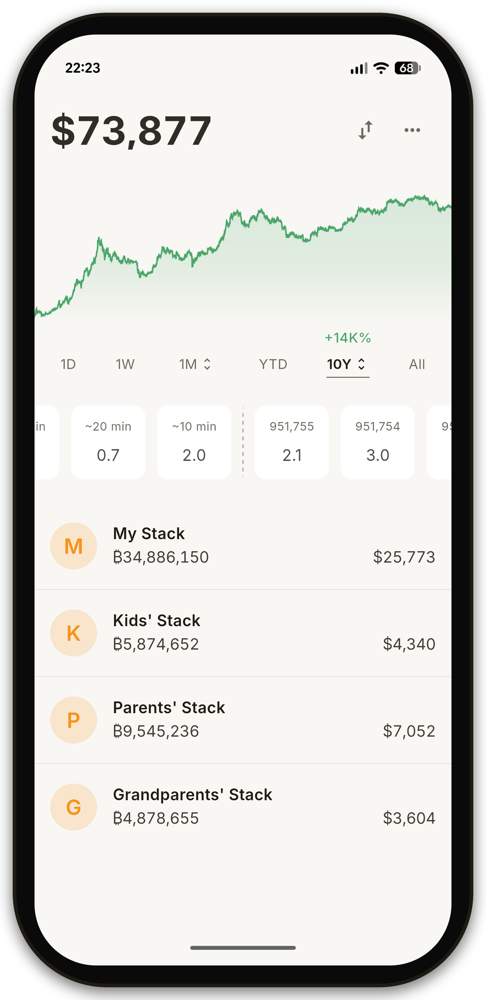

# Open Bitcoin Tracker

Open Bitcoin Tracker (OBT) **is not a wallet.** It doesn't send, receive, or hold bitcoin; it's a tracker for long-term hodlers who want to keep an eye on the value of their stacks.

The amount of bitcoin is entered manually, so no public keys are exposed, it has instant startup and minimal battery impact.

Everything is stored on your phone and it's never uploaded anywhere.

Free and open-source Android app.

  

## Install

Download the latest APK from the [Releases](https://github.com/Max-Hodler/open-bitcoin-tracker/releases) page and install it on your device. You may need to enable **Install unknown apps** in your Android settings for your browser or file manager.

## Features

- **Live BTC price** — Updated in real time.
- **Stacks** — Organize your Bitcoin into multiple labeled portfolios (e.g. "My Wallet", "Kids", "Mum").
- **Converter** — Instantly convert between satoshis and any supported fiat currency with a full numeric keypad.
- **Mempool** — Live feed of the next pending blocks to keep an eye on the current median fee.
- **Hashrate** — Network hashrate chart so you can track Bitcoin's network security.
- **Themes** — Light and Dark modes with 4 themes in total.
- **Languages** — Available in Deutsch, English, Español, Français, Italiano, Português, Türkçe, Tiếng Việt, Русский, and 日本語.

## Privacy & security

- **No public keys** — You don't need to enter your bitcoin public keys.
- **Private viewing** — Lock your stacks with a PIN or biometrics so you can check the price without revealing your holdings.
- **No accounts, no servers.** The app fetches the current bitcoin price from Kraken and nothing else. There's no login, no cloud sync, no analytics, and no telemetry.
- **No tracking.** The app does not collect, transmit, or share any personal information.

## License

MIT — see [LICENSE](LICENSE).

## Contributing

Bug reports, suggestions, and pull requests are welcome. See [CONTRIBUTING.md](CONTRIBUTING.md) for setup instructions and project structure.
